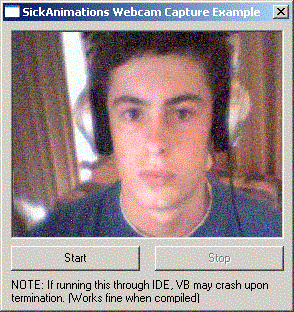



## Webcam Capture Example \(Too Easy\)

### Description

This Example is perfect for anyone making instant messengers, user databases, and even just for home surveilance. And the best part is, it is very easy to understand and put into your own applications. I commented on as much as possible.
 
### More Info
 

             |
---                |---
**Submitted On**   |2003-01-18 20:33:02
**By**             |[SickAnimations](https://github.com/Planet-Source-Code/PSCIndex/blob/master/ByAuthor/sickanimations.md)
**Level**          |Intermediate
**User Rating**    |4.6 (60 globes from 13 users)
**Compatibility**  |VB 6\.0
**Category**       |[Windows API Call/ Explanation](https://github.com/Planet-Source-Code/PSCIndex/blob/master/ByCategory/windows-api-call-explanation__1-39.md)
**World**          |[Visual Basic](https://github.com/Planet-Source-Code/PSCIndex/blob/master/ByWorld/visual-basic.md)
**Archive File**   |[Webcam\_Cap1531241182003\.zip](https://github.com/Planet-Source-Code/sickanimations-webcam-capture-example-too-easy__1-42549/archive/master.zip)

